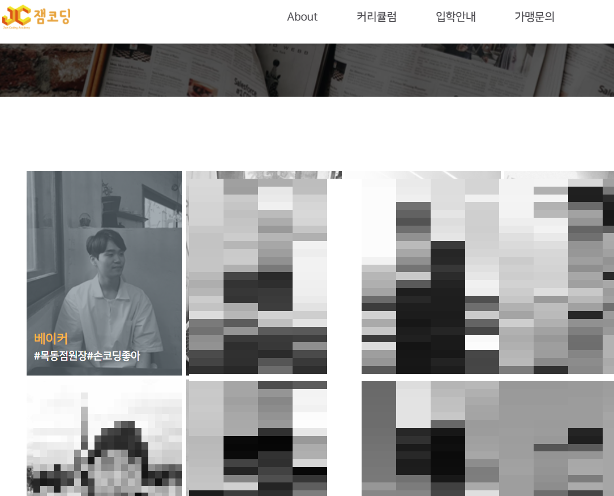
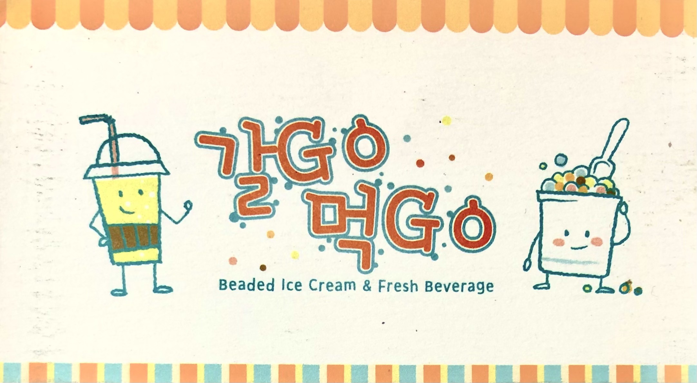
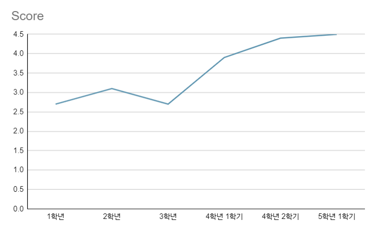

# 이력서

## 소개

* 이름 : 이우림
* **갤럽 강점** : 화합(Harmony), 지적사고(Intellection), 복구(Restorative), 책임(Responsibility), 미래지향(Futuristic)
* 군필 : 의경 만기 전역
* 취미 : 풋살, 게임, 위스키, 과외, 독서
* **새로운 것**을 배우는 걸 가장 좋아합니다.
* Email : and_lamyland@naver.com
* [네이버 블로그](https://blog.naver.com/and_lamyland)
    * 지식의 공유를 위해 C, Python 등의 언어 개념과, 알고리즘, OS 등을 정리한 블로그입니다.

## 연도별 경력
* [그리닝 북촌](https://www.airbnb.co.kr/rooms/52308191)(2021.09 ~ 현재)
    - 주변의 한옥 게스트하우스와 차별점을 둔 서비스 제공으로 46개의 후기를 만점으로 받으며 슈퍼 호스트로 등록되었습니다.

* [잼코딩](https://jamcoding.co.kr/)(2018.04. ~ 2020.09.)
    - 코딩 강사로 근무하며 C, C++, Python 문법과 알고리즘 수업을 진행했습니다.
    - 신규 강의 개설, 개인 맞춤형 수업 진행, 업무 통합 시트 제작 등의 업무를 주도적으로 진행했습니다.
    - 학생 300% 증가, 고등학생 대입률 100% 등의 성과를 통해 강사에서 원장까지 승진할 수 있었습니다.

* 생과일 주스 가게 창업 (2014)
    - 브런치 가게 10곳을 조사해 개발한 신메뉴로 매출액을 150% 신장시킨 경험이 있습니다.

* 광운대학교 전자정보통신공학과 졸업 (2011 ~ 2018)
    - 전자정보통신공학과 학생회장 (2012 ~ 2014)
        - 12년 학생회장일 당시에 학과실 리모델링, 최초 학과 주점 및 MT 개최 등의 성과를 교수님들과 학우들로부터 인정받아 13년도에 학생회장을 연임한 경험이 있습니다.
    - 논문 : Drowsiness driving detection
        - 영상처리와(빛 영상 전처리) 지도학습 기반의 안구 검출을 통한 졸음운전 감지 시스템입니다.
        - 자세한 내용은 [이 링크](https://github.com/woorimlee/drowsiness-detection)에서(깃허브 저장소) 보실 수 있습니다.
    - 이동네트워크 연구실 (2018.02 ~ 2018.08)
        - 6개월간 학부 연구생 활동을 하며 NFV 개념을 학습한 경험이 있습니다.
    - 학점

## 수상 경력
#### 2021 피우다 프로젝트(서울시) : 우수상 (2위)
* 2021.04 ~ 2021.10. 
* 서울시 도시 문제를 해결하는 공모전에서 예비 요식업 창업자를 위해 창업 지역을 추천해주는 프로그램을 개발했습니다.
* feature 수집 및 회귀 분석을 통한 주요 feature 선정, 미래 매출액 예상, 리뷰 데이터 크롤링을 맡았습니다.
* 향후 2분기의 예측 매출액과 실제 매출액이 100만 원 이하의 오차밖에 나지 않았고 결정 계수 값은 0.915가 나왔습니다.
* 서울시 대회 수상 후 전국 대회에 출전한 경험이 있습니다.
    * [2021 전국 인공지능 문제해결 아이디어 공모 왕중왕전 발표 및 시상식 (1:35:45 ~)](https://www.youtube.com/watch?v=ZZI5sKrIFQE)

## 사용 가능 언어
* C++ (보통) : 이미지 전송 및 멀티 채팅이 가능한 서버 & 클라이언트 프로그램, 프로세스 스케줄링 및 동기화 등 리눅스 시스템 프로그래밍 경험.
* Python (능숙) : 졸음운전 감지 시스템(OpenCV, 조명 영상 처리, K-NN 알고리즘 활용), 텔레그램 봇, 미래 매출액 예상 프로그램 들의 개발 경험.
* MFC(경험 있음) : 오목 게임, 카드 짝 맞추기 게임 프로그래밍 경험.
* Java(경험 있음) : 기본적인 소켓 프로그래밍 경험.
* C#, Unity2D (경험 있음) : 비행기 슈팅 게임, Flappy Bird, 런 게임 제작 경험.

## 자격증
* 정보처리기사 (2020.09)
* OPIC IM2 (2021.02)

## 수료한 강의
* Tips 17기 (2017) 
    - tipssoft에서 주최한 강좌를 통해 C, C++, Win32, MFC를 배우고 오목, 카드 맞추기 게임 등을 만듦
    - 오목 게임. 자세한 내용은 [이 링크](https://blog.naver.com/and_lamyland/221077503952)에서 보실 수 있습니다.
    - 카드 짝 맞추기 게임. 자세한 내용은 [이 링크](https://blog.naver.com/and_lamyland/221079728502)에서 보실 수 있습니다.

* Unity 엔진을 활용한 나만의 모바일 게임 제작 (2018)
    - 플래피 버드. 자세한 내용은 [이 링크](https://blog.naver.com/and_lamyland/221466912040)에서 보실 수 있습니다.
    - 런 게임. 자세한 내용은 [이 링크](https://blog.naver.com/and_lamyland/221466925023)에서 보실 수 있습니다.

* 서울ICT이노베이션스퀘어 인공지능 중급 (2021)
    - 머신러닝(회귀, 분류, 군집 분석) 딥러닝(DNN, CNN, RNN) 학습

  
여기까지 읽어주셔서 감사합니다. 
부족한 부분이나 더 궁금하신 내용이 있으시다면, and_lamyland@naver.com으로 연락주세요. 
감사합니다.
